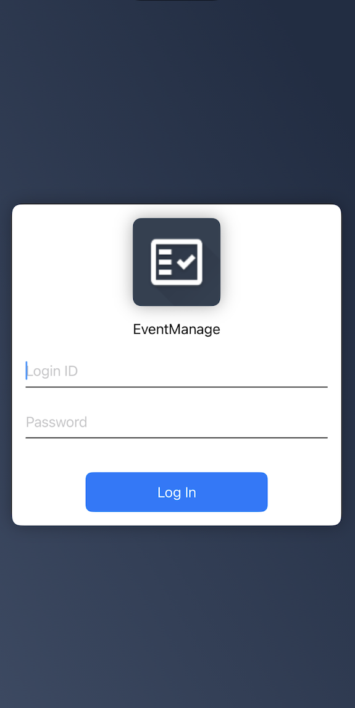
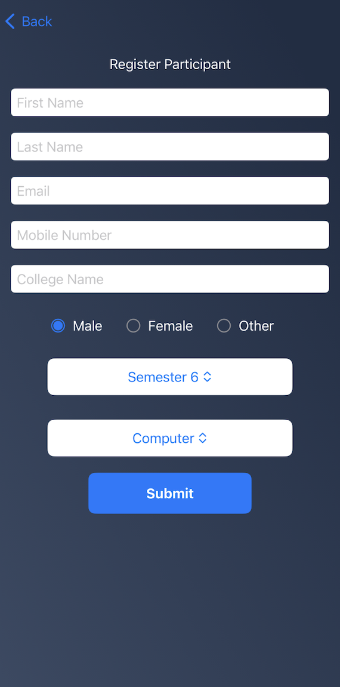
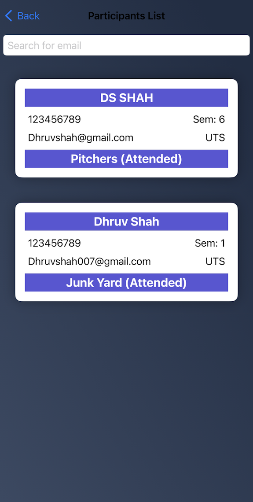

# EventManage

Subject: 42889 - iOS Application Development (Autumn 2024)

Assesment Task 3: Group Project

Project Name: EventManage - QR Code based attendance system in Event Management.

Github Repo: https://github.com/DhruvShah2710/EventManage

## Group Members
- Dhruv Shah (14022774)
- Jasminkumar Thummar (25141755)
- Akhil Jomon (25144104)

## Images

- Login Page

- Dashboard Page (Cooridinator)

- Dashboard Page (Campaigner)

- Participant Registration Page

- Event Registration Page

- Attendance Done Page

- Participants List Page

